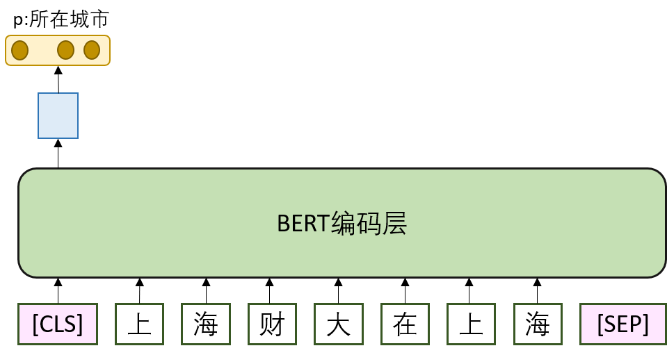
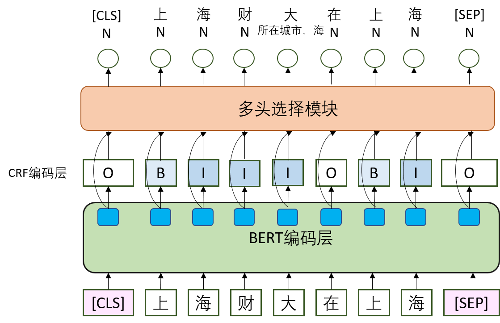

# SKE_BERT_RE
BERT based solution for IE problem in 2019 Language and Intelligence Challenge.

# Requirements
- Python 3.7
- pytorch 1.10
- OpenKE

# Data
Download from [2019 Language and Intelligence Challenge](http://lic2019.ccf.org.cn/kg)
Put data resources into `raw_data/chinese`

# Solution
### two steps solution
 
Firstly do the multi-label relation extraction`pso_1`, secondly do the entity extraction`pso_2` with Bert structure.

pso_1            |  pso_2
:-------------------------:|:-------------------------:
 |  

### multi head selection solution

Replace the lstm structure with Bert for the paper [Joint entity recognition and relation extraction as a multi-head selection problem](https://arxiv.org/abs/1804.07847).



# Run 
### preprocess
```shell
python main.py --mode preprocessing --exp_name chinese_bert_re
python main.py --mode preprocessing --exp_name chinese_bert_pso --type pso_1
```

### train the model
```shell
python main.py --mode train --exp_name chinese_bert_re
python main.py --mode train --exp_name chinese_bert_pso --type pso_1
python main.py --mode train --exp_name chinese_bert_pso --type pso_2
```
### reload the model from some epoch
```shell
python main.py --mode reload --exp_name chinese_bert_re --epoch $epoch
python main.py --mode reload --exp_name chinese_bert_pso --type pso_1 --epoch $epoch
python main.py --mode reload --exp_name chinese_bert_pso --type pso_2 --epoch $epoch
```
### evaluate the model - NER and Triplets F1 score
```shell
python main.py --mode evaluation --exp_name chinese_bert_re
python main.py --mode evaluation --exp_name chinese_bert_pso --type pso_1
python main.py --mode evaluation --exp_name chinese_bert_pso --type pso_2
```
## postcheck
- build triple knowledge graph 
- distant supervision to enrich triples
- triple classification with XGBOOST  

Features | Descriptions  | Resources
------------------------------------- | :------: | :------:
score | the triple confidence score for two steps / multi head selections | 
rank | the relative rank for triple confidence score in one sample candidate triples | 
transe | the transe score for one triple (s,p,o) | [Triple Trustworthiness Measurement for Knowledge Graph](https://arxiv.org/abs/1809.09414)
sdvalidate | the sdvalidate value for one triple (s,p,o) | [Improving the Quality of Linked Data Using Statistical Distributions](http://www.heikopaulheim.com/docs/ijswis_2014.pdf)
one hot label| predicates for one sample candidate triples | 
seg| whether the subject/object boundaries consistent with word segment | 

### distant supervision
cancel comment on `self.spo_search(text,result)`

### triple classification
- prepare positive negative samples
- prepare TransE score

#### prepare positive negative samples for Training data
cancel comment on `tester.run()` , get `pos_neg.json` output
```shell
python lib/kg/negative_sample.py
``` 
Modify tag `xgb_train_root` in `experiments` to according run .json, like `pos_neg_score.json`,
Then rerun the model to get the model confidence score for pos/neg data and get the ouput `pos_neg_score.json`.
```shell
# multi-head selection
python main.py --mode postcheck --exp_name chinese_bert_re
# pso two steps model
python main.py --mode postcheck --exp_name chinese_bert_pso --type pso_2
```
#### prepare for dev data
For dev data, modify tag `xgb_train_root` to `dev.json`.  
If use multi-head model, just run 
```shell
python main.py --mode postcheck --exp_name chinese_bert_re
```
If pso two steps model
```shell
python main.py --mode postcheck --exp_name chinese_bert_re
```
then comment on `tester.spo_search_res()`, `scp error/chinese_bert_pso/dev.json data/chinese_bert/pso/dev.json`,then rerun
```shell
python main.py --mode postcheck --exp_name chinese_bert_re
```

#### prepare TransE score
prepare train/dev data proper format for OpenKE, get the data in `data/transe` fold
```shell
python prepare_transe.py --mode train/dev
```
place the `entity2id.txt`,`relation2id.txt`,`train2id.txt` to base_path in OpenKE packages and run 
```shell
python lib/transe/run_transe.py --mode train/dev
```
get the embedding of (s,p,o) triple, scp the output(*.pickle) to the path `lib/transe`
```shell
python lib/transe/get_embedding.py
```
#### XGBOOST Model
Firstly, for the training data, then for the dev data.
```shell
python kg/post_check.py 
```

### Others
#### Model Ensemble


#### Bert attention visualization
see in `lib/metrics/attn_vis.py`

